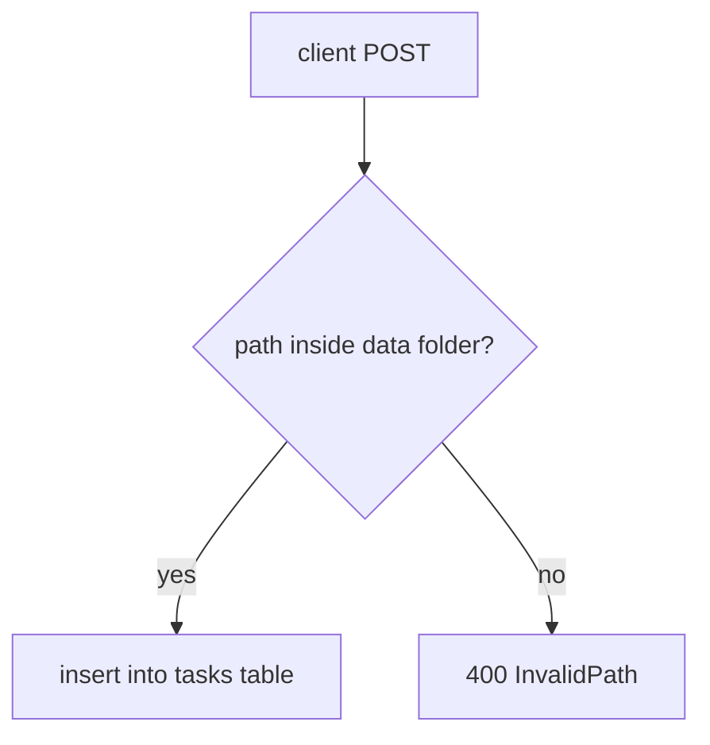

# AgentBoard — Frontend Engineering & Design Specification

> **Codename:** *Specimen*
> **Status:** Design proposal, supersedes §11 ("Aesthetic — Dark Glassmorphism") of `TDD.md` only
> **Audience:** Frontend engineers implementing the React 19 + Vite shell against the existing FastAPI backend
> **Last revised:** 2026-05-01

---

## 0. One-Paragraph Summary

AgentBoard is a workbench where AI agents file work and a human reads it. The interface should feel less like a productivity SaaS dashboard and more like a **laboratory catalog**: paper-grade typography, hairline rules, monospace telemetry, a single signal color used sparingly. Every pixel is justified by a question the operator is actually asking: *what arrived, what changed, what is blocked, what does the agent want me to look at?* If a treatment doesn't answer one of those, it does not ship.

---

## 1. Design Brief

### 1.1 The user
A single human operator, sitting at a desk, glancing at the board between deeper tasks. They are not "managing a team" — they are **inspecting agent output**. Cognitive budget is low (context-switched, possibly ADHD), aesthetic taste is high (the operator chose to install this and chose Inter, glass, violet — they will notice details).

### 1.2 The job
1. *Did anything new arrive in the last 5 seconds?* — Surface deltas without animation noise.
2. *What is this card actually about?* — Render Markdown + Mermaid as if it were a scientific figure, not a tweet.
3. *Where is it in the workflow?* — Column position, owner, parent epic, linked tasks.
4. *What did the agent say in the comments?* — Append-only log, easy to scan in reverse-chronological order.
5. *Move things.* — Drag a task to a new column, reorder columns. Rare, but must be precise.

### 1.3 The aesthetic commitment
**Scientific Minimalism** — paper, rule, ink, one accent.
Not Notion. Not Linear. Not glassmorphism. Not "AI dashboard" gradient mesh.
Closer to: a Letraset catalog, a Braun T1000 receiver, a Tufte sparkline page, an entry in *Annals of Mathematics*.

**What we reject:**
- Drop shadows, blur, glow, "frosted glass," neon
- Rainbow status chips, emoji status, gradient buttons
- Floating action buttons, toast carousels, skeleton shimmer
- Generic system fonts (Inter, Roboto, SF Pro, Arial)
- Decorative iconography that doesn't carry information
- Animations longer than 180 ms or that move more than 8 px
- Anything that wouldn't survive being printed on A4 in black and white

---

## 2. Design Tokens

All tokens are CSS custom properties on `:root`, consumed via Tailwind `theme.extend.colors` & arbitrary values. The Tailwind config in §10.

### 2.1 Color — `--c-*`

The palette is intentionally tiny. Two surfaces, two inks, one signal, one cool data color. That is all.

| Token            | Light (default)        | Dark (opt-in via `[data-theme="dark"]`) | Role                                              |
| ---------------- | ---------------------- | --------------------------------------- | ------------------------------------------------- |
| `--c-paper`      | `#F8F6F1`              | `#0E0F11`                               | Page background                                   |
| `--c-paper-2`    | `#F2EFE7`              | `#16181B`                               | Recessed surface (sidebar, footer rule strip)     |
| `--c-card`       | `#FFFFFF`              | `#1A1C1F`                               | Card / specimen surface                           |
| `--c-ink`        | `#11151C`              | `#EDE8DA`                               | Primary text, primary rule                        |
| `--c-ink-2`      | `#11151C` @ 64%        | `#EDE8DA` @ 64%                         | Secondary text                                    |
| `--c-ink-3`      | `#11151C` @ 36%        | `#EDE8DA` @ 36%                         | Tertiary / hairline rule                          |
| `--c-ink-4`      | `#11151C` @ 12%        | `#EDE8DA` @ 12%                         | Hairline-rule background grids                    |
| `--c-signal`     | `#B6451E` (oxidized cu)| `#D87644`                               | Single signal color — selection, focus, "new"     |
| `--c-signal-ink` | `#FFFFFF`              | `#0E0F11`                               | Text on signal fill                               |
| `--c-data-cool`  | `#22467A`              | `#7AA7D9`                               | Charts/sparklines only — never UI chrome          |
| `--c-warn`       | `#7A4A05`              | `#D9A14A`                               | `content_error: file_missing` and similar         |

**Rules of use**
- `--c-signal` appears on **at most one element per viewport** at any time. It is a focus locator, not a brand color.
- Status (`Todo` / `In Progress` / `Done`) is conveyed by **column position only**, not by color. There are no colored chips.
- "New since last poll" is signaled by a 1-px `--c-signal` left rule on the card that fades to `--c-ink-4` over 8 seconds. No motion, no badge.

### 2.2 Typography — `--f-*`

Three families. None of them are in the AI-default set.

| Token        | Family                                     | Use                                                                |
| ------------ | ------------------------------------------ | ------------------------------------------------------------------ |
| `--f-display`| **Newsreader** (variable, optical sizes)   | Card titles, page H1/H2, epic names                                |
| `--f-body`   | **Söhne** → fallback **Geist** (variable)  | Markdown body, paragraph text, comment bodies                      |
| `--f-mono`   | **JetBrains Mono** (variable)              | Specimen IDs (TASK-001), timestamps, telemetry, code, kbd, table data |

All three are self-hosted via `@fontsource-variable`. No Google Fonts CDN dependency. Subset to Latin-Extended + a small symbol set (★ ◇ ▪ ↗ → ⋯ ▢).

**Type scale** — modular, 4-pt grid, ratio 1.2 (minor third):

| Token            | Size / Line   | Family       | Tracking | Use                                  |
| ---------------- | ------------- | ------------ | -------- | ------------------------------------ |
| `--t-meta`       | 11 / 14       | mono         | +0.06em  | IDs, timestamps, column headers      |
| `--t-label`      | 12 / 16       | mono uppercase | +0.10em| Section labels, field names          |
| `--t-body-sm`    | 13 / 20       | body         | 0        | Card metadata line                   |
| `--t-body`       | 15 / 24       | body         | 0        | Markdown paragraphs, comments        |
| `--t-card-title` | 18 / 24       | display      | -0.005em | Task / epic card titles              |
| `--t-h2`         | 22 / 28       | display      | -0.01em  | Section titles, modal titles         |
| `--t-h1`         | 32 / 36       | display      | -0.015em | Page title (Board / Epics)           |
| `--t-display`    | 56 / 60       | display      | -0.02em  | Empty-state numerals, splash         |

Optical sizing is on (`font-variation-settings: "opsz" auto`). No fake bold; weight is a continuous axis.

### 2.3 Spacing — `--s-*`

A **strict 4 px grid**. No exceptions. Tailwind defaults already align; we shadow only the names that carry semantic meaning:

| Token          | Value | Use                                                  |
| -------------- | ----- | ---------------------------------------------------- |
| `--s-hair`     | 1 px  | Borders, rules                                       |
| `--s-tight`    | 4 px  | Inline gap between meta items                        |
| `--s-snug`     | 8 px  | Card internal padding (vertical between meta lines)  |
| `--s-card`     | 16 px | Card padding, gap between cards in a column          |
| `--s-gutter`   | 24 px | Column gutter, section gap                           |
| `--s-page`     | 48 px | Page horizontal padding (≥ md), top page margin      |
| `--s-margin`   | 96 px | Catalog left margin (where specimen IDs hang)        |

### 2.4 Radius, border, elevation

- **Radius:** `2 px` everywhere. Cards, inputs, buttons. No `rounded-2xl`. The interface is *paper*, not *pebble*.
- **Border:** always 1 px solid using `--c-ink-3` (or `--c-ink-4` for inner grid lines). Never two-tone. Never dashed except for *active drop targets* (see §6.3).
- **Elevation:** **none**. There are no `box-shadow`s in the interface. Depth is conveyed by rule weight and position, not light. The only acceptable shadow is `0 0 0 2px var(--c-signal)` for focus rings.

### 2.5 Motion — `--m-*`

| Token        | Value                  | Use                                                  |
| ------------ | ---------------------- | ---------------------------------------------------- |
| `--m-fast`   | 80 ms ease-out         | Hover state changes (rule weight, ink shift)         |
| `--m-base`   | 160 ms ease-out        | Drawer open, modal fade-in                           |
| `--m-fade`   | 8 s linear             | "New" rule decay (only long-running animation)       |
| `--m-easing` | `cubic-bezier(.2,.8,.2,1)` | Drag drop snap                                  |

No spring physics. No bouncing. No staggered reveals on page load — the page renders once, instantly. **`prefers-reduced-motion: reduce` disables all transitions** except the focus ring transition, which is essential for keyboard users.

---

## 3. Core Layout — The Plate

Every page is composed onto a "plate": a sheet of `--c-paper` with a 96-px left margin (the **catalog gutter**) where specimen IDs hang, and a content column to the right.

```
┌────────────────────────────────────────────────────────────────────────┐
│  ▢ AGENTBOARD            [Board] · Epics      ◇ 2026-05-01 · 14:22:07 │   ← top rule (1 px)
│────────────────────────────────────────────────────────────────────────│
│                                                                        │
│ TASK-014 │  ┌─────────────────────────────────────────────────────────┐│
│          │  │ Refactor path validator into a service                  ││   ← display serif title
│          │  │ ─────────────────────────────────────────────────────── ││   ← hairline
│ EPIC-002 │  │ EPIC-002 · agent: claude-code · 12 min ago              ││   ← mono meta
│  · 3/8   │  │                                                         ││
│          │  │ Replace inline `Path.resolve` calls in main.py with a   ││   ← body sans
│          │  │ small `paths.validate()` helper that returns a typed…   ││
│          │  └─────────────────────────────────────────────────────────┘│
│                                                                        │
│ TASK-015 │  ┌─────────────────────────────────────────────────────────┐│
│ ▌        │  │ Add WAL-mode pragma sanity test               · NEW ▪   ││   ← signal rule
│ …        │  │ ─────────────────────────────────────────────────────── ││
│          │  │ standalone · agent: alok · 3 sec ago                    ││
└────────────────────────────────────────────────────────────────────────┘
   ↑              ↑
   catalog gutter  content column
   (96 px)         (max-width 1280 px)
```

### 3.1 Application chrome

A **single 48-px-tall top rule strip**. Left: wordmark `▢ AGENTBOARD` in `--f-mono` uppercase. Center: route tabs (`Board`, `Epics`) — the active tab is *not* highlighted with a pill or underline; it is set in `--c-ink` while inactive tabs are `--c-ink-3`. Right: a live UTC clock in `--f-mono` (this is honest about the polling cadence — the operator can see the second hand tick) and a tiny `◇` glyph that pulses to `--c-signal` for one frame whenever a poll returns new data.

**No sidebar.** The catalog gutter is the navigation. There is no "+ New" button in the chrome — creation happens via API (the agents) or via `n` keypress (the human, see §7).

### 3.2 The catalog gutter

A 96-px column on the left of every page, vertically aligned to the top of each row, containing:
1. The specimen ID in `--t-meta` (e.g. `TASK-014`)
2. Optional parent breadcrumb in `--t-meta` `--c-ink-3` (e.g. `EPIC-002 · 3/8`)
3. A 1-px vertical rule connecting children of the same epic (a "lineage line")

The gutter is what makes the application feel like a catalog and not like a Trello clone. Do not collapse it on tablet; instead, reduce content column width. On phone (`< sm`), the gutter folds into a single line above each card.

---

## 4. Screen: Board (`/`)

The Board is the primary screen. Columns are rendered horizontally, each as a labeled section on the same plate, scrolling **vertically as a single document** (not a horizontal scroller — this is a deliberate departure from Trello/Linear).

> **Why vertical, not horizontal?** A horizontal scroller hides Done from view and rewards constantly dragging the scroll bar. For an agent firehose feed, vertical scrolling matches the operator's reading flow (top-to-bottom = priority). The visual metaphor is a **field journal**, not a whiteboard.

### 4.1 Anatomy

```
TODO — 4 specimens                                              [ + add column ]
────────────────────────────────────────────────────────────────────────────
TASK-014 │  Refactor path validator into a service
TASK-015 │  Add WAL-mode pragma sanity test                            · NEW
TASK-018 │  Document `/api/columns/reorder` semantics
TASK-021 │  Cap content_path file size at 1 MB

IN PROGRESS — 2 specimens
────────────────────────────────────────────────────────────────────────────
TASK-009 │  Implement Mermaid block renderer
TASK-012 │  Wire TanStack Query polling

DONE — 11 specimens                                               [ ▾ collapse ]
────────────────────────────────────────────────────────────────────────────
…
```

- **Column header:** `--t-label` uppercase mono (`TODO`), em-dash, `n specimens` count in `--c-ink-2`. To the right, an inline ghost button `+ add column` (only visible on hover of the page).
- **Column body:** vertical stack of cards, separated by 16 px.
- **Done column** is **collapsed by default** (header + count + chevron only). Expand on click. Done lives below In Progress and below Todo because the operator does not need to scan it constantly. State persisted in `localStorage` keyed by column id.

### 4.2 The TaskCard

Each task is a `<article>` with a 1-px ruled border. **No shadow. No hover lift.** Hover state: border weight remains 1 px; border color steps from `--c-ink-3` to `--c-ink`.

```html
<article
  class="task-card"
  data-task-id="14"
  data-new={isNew(updatedAt)}
  aria-labelledby="task-14-title">

  <header class="task-card__meta">
    <span class="task-card__id">TASK-014</span>
    <span class="task-card__sep">·</span>
    <a class="task-card__epic" href="/epics/2">EPIC-002</a>
    <span class="task-card__sep">·</span>
    <span class="task-card__assignee">claude-code</span>
    <time class="task-card__time" datetime="2026-05-01T14:10:32Z" title="2026-05-01 14:10:32 UTC">12 min ago</time>
  </header>

  <h3 id="task-14-title" class="task-card__title">
    Refactor path validator into a service
  </h3>

  <p class="task-card__excerpt">
    Replace inline <code>Path.resolve</code> calls in <code>main.py</code> with a
    small <code>paths.validate()</code> helper that returns a typed result…
  </p>

  <footer class="task-card__rule" aria-hidden="true"></footer>
</article>
```

**Visual specification**
- Card padding: 16 px all sides.
- Title: `--t-card-title` Newsreader, weight 480 (semibold-ish), color `--c-ink`. Two-line clamp with hanging punctuation.
- Excerpt: `--t-body-sm` Söhne/Geist, `--c-ink-2`, three-line clamp. Excerpt is the **first paragraph of the Markdown content**, server-truncated to 240 chars in the list response (we'll add `excerpt` to the `GET /api/tasks` payload — see §11).
- Meta row: 13 px tall, `--f-mono`, `--c-ink-3`, dot separators (`·`) at 4-px tracking.
- The `data-new` attribute paints a 1-px `--c-signal` rule on the **left edge only** (using `box-shadow: inset 1px 0 0 var(--c-signal)` — the one acceptable shadow). It fades to `--c-ink-4` over 8 s via `--m-fade`. After fade, the rule disappears entirely.
- Inline `<code>` in the excerpt uses `--f-mono` at 0.92em with `--c-ink-4` background, **no** border or radius.

### 4.3 Empty state

When a column has zero tasks:

```
TODO — 0 specimens
────────────────────────────────────────────────────────────────────────────

                        ◇  no specimens
                        nothing has been filed in this column.
                        agents may register a task at POST /api/tasks.

```

`--t-display` `0` numeral could be tempting but resist — the empty state is a single muted line, not a hero illustration. We're not Slack.

---

## 5. Screen: Epics (`/epics`)

Epics are not Tasks. They are **containers with a roll-up**. The Epics page is a single ruled table — closer to a periodic table or a spec sheet than to a card grid.

```
EPICS                                                    SHOWING 6 OF 6

┌────────────┬────────────────────────────────────────┬──────────┬──────────────┐
│ EPIC       │ TITLE                                  │ ASSIGNEE │ PROGRESS     │
├────────────┼────────────────────────────────────────┼──────────┼──────────────┤
│ EPIC-001   │ Backend foundations                    │ alok     │ 8/8  ████████│
│ EPIC-002   │ Frontend shell                         │ claude   │ 3/8  ███░░░░░│
│ EPIC-003   │ Mermaid + Markdown rendering           │ —        │ 0/4  ░░░░░░░░│
│ EPIC-004   │ Drag-and-drop columns                  │ alok     │ 1/3  ███░░░░░│
└────────────┴────────────────────────────────────────┴──────────┴──────────────┘
```

- Table is the primary view. No card mode toggle. Tables are *underrated* in modern web UI; they are dense, scannable, and copy-paste-friendly.
- Progress column uses an **8-cell sparkbar** in `--f-mono` (block characters `█░`) — not a styled `<progress>` bar. This keeps the table copy-pasteable into a Markdown file.
- Hover row: row background steps to `--c-paper-2`. Click navigates to `/epics/:id`.
- Sortable columns: click header to sort, indicator is a hair-line `↑` / `↓` glyph in `--c-ink-3`. Default sort: position desc.

---

## 6. Screen: Detail (`/tasks/:id`, `/epics/:id`)

The detail view is the **main reading surface**. It is treated as a one-column scientific paper, not a sidebar+canvas SaaS layout.

### 6.1 Anatomy

```
[ ← back to board ]
                                                              TASK-014
                                                              EPIC-002 · 3/8
Refactor path validator into a service
─────────────────────────────────────────────────────────────────────────────
agent: claude-code · created 2026-05-01 14:10 · updated 2026-05-01 14:18

Replace inline `Path.resolve` calls in `main.py` with a small
`paths.validate()` helper that returns a typed result…

## Plan
1. Extract `validate_content_path` to `app/paths.py`
2. …


                                                            Fig. 1
─────────────────────────────────────────────────────────────────────────────
JOURNAL                                                          3 entries

claude-code   2026-05-01 14:18:09                  ▪
  Started extraction. Tests still green.

alok          2026-05-01 14:21:44                  ▪
  Add a regression test for the symlink case before merging.

claude-code   2026-05-01 14:22:30                  ▪
  Acknowledged. Adding `test_symlink_escape_resolves_strict`.

[ + add journal entry ]
```

### 6.2 Markdown rendering

This is where the design **earns its keep**. Markdown is rendered with `react-markdown` + `remark-gfm`, but with an opinionated component map:

| Element | Treatment                                                                                |
| ------- | ---------------------------------------------------------------------------------------- |
| `h1`    | `--t-h1` display serif, with a 1 px rule beneath. Numbered automatically as §1, §2…      |
| `h2`    | `--t-h2` display serif, no rule, +24 px top margin                                       |
| `p`     | `--t-body` Söhne/Geist, max-width **66ch** for readability                                |
| `code`  | inline: `--f-mono` 0.92em, `--c-ink-4` background, no radius                             |
| `pre`   | block: `--f-mono` on `--c-paper-2` background, 1 px ruled, language label top-right       |
| `table` | hairline-ruled, header row in `--t-label` mono uppercase                                  |
| `ul/ol` | hanging bullets in `--c-ink-3`; ordered lists use lining figures from JetBrains Mono    |
| `blockquote` | 4 px left rule in `--c-signal`, italic Newsreader, `--c-ink-2` text                  |
| `mermaid` | rendered as `<MermaidBlock>` (see §6.4) and captioned `Fig. N`                          |
| `task list` (`- [ ]`) | Custom checkbox: 12 px box, hairline border, filled with `--c-ink` cross when checked |

A hairline rule precedes every `h1` (mimicking journal article section breaks). Long `pre` blocks scroll horizontally inside their container; **no soft-wrap on code**.

### 6.3 Drag and drop

Two operations. Both are precise, neither is bouncy.

**Column reorder.** Grab the column header (cursor: `grab`). On drag-start, the header element gets a 1-px dashed `--c-signal` outline and lifts to `opacity: 0.85`. Other columns shift in 80 ms `ease-out`. Drop snaps in 120 ms via `--m-easing`. **No drag preview overlay** — we rely on `@dnd-kit`'s native ghost.

**Task → column move.** Grab a card. The card itself becomes `opacity: 0.4` (the placeholder), and a **1-px ghost rectangle** with a dashed `--c-signal` outline tracks the cursor. The valid drop target column header gets a `--c-signal` left rule (1 px). On drop, the card flies in 120 ms with `--m-easing` to its new column position.

Within-column reordering is **out of scope for v1** — the TDD already locks this. Cards are listed by `updated_at DESC`.

### 6.4 Mermaid as scientific figure

`<MermaidBlock>` renders the diagram inside a 1-px ruled box, captioned **`Fig. N`** in `--t-label` aligned right, and **assigned a stable monotonic figure number** within the document (so a long Markdown file with 4 mermaid diagrams gets `Fig. 1` … `Fig. 4`).

Mermaid is initialized with a custom theme that **ignores the dark/violet palette** and uses our token set:

```ts
mermaid.initialize({
  startOnLoad: false,
  theme: 'base',
  themeVariables: {
    background: 'var(--c-paper)',
    primaryColor: 'var(--c-card)',
    primaryTextColor: 'var(--c-ink)',
    primaryBorderColor: 'var(--c-ink)',
    lineColor: 'var(--c-ink-2)',
    fontFamily: 'var(--f-mono)',
    fontSize: '12px',
  },
  flowchart: { curve: 'linear', htmlLabels: false },
});
```

`curve: 'linear'` is deliberate — straight lines, not curvy ones. Engineering diagrams, not infographics.

### 6.5 Comments → Journal

Comments are renamed in the UI to **Journal entries** — this is a deliberate mental model shift. Each entry is:

```
claude-code   2026-05-01 14:22:30                  ▪
  Acknowledged. Adding `test_symlink_escape_resolves_strict`.
```

- Author in `--f-mono` `--c-ink`, fixed-width column (16ch) so timestamps align.
- Timestamp in `--f-mono` `--c-ink-3`, ISO 8601, **always UTC**, never relative ("3 min ago"). The operator wants exact times for correlating with logs.
- Body in `--t-body` Söhne/Geist, indented 32 px (the catalog gutter motif again).
- A small `▪` glyph far-right marks the latest entry (resets every poll).

Compose box is a single textarea pinned to the bottom of the journal section. Author name is auto-filled from `localStorage.author` (set on first visit) — no auth, but the human gets to set their handle once. `Cmd/Ctrl+Enter` submits. No formatting toolbar; Markdown is supported and rendered on display only.

---

## 7. Interaction & Keyboard

The operator should be able to live in this app without ever touching the mouse for read operations.

| Key         | Action                                                            |
| ----------- | ----------------------------------------------------------------- |
| `j` / `k`   | Move focus to next / previous card (vim-style)                    |
| `g` `b`     | Go to Board                                                       |
| `g` `e`     | Go to Epics                                                       |
| `Enter`     | Open focused card                                                 |
| `Esc`       | Close detail / modal / cancel drag                                |
| `n`         | New journal entry on focused card (open compose box)              |
| `c`         | Collapse / expand focused column                                  |
| `/`         | Focus the (subtle) filter input in the chrome                     |
| `?`         | Show keyboard shortcut sheet (modal, ruled, mono)                 |
| `t`         | Toggle theme (light ↔ dark)                                       |

Focus ring: `0 0 0 2px var(--c-signal)` — this is the **only** acceptable use of `box-shadow` in the design. Always visible, never `outline: none`.

Tab order follows DOM order: chrome → tabs → catalog gutter is `aria-hidden`, focus skips to first card → cards in column order → footer.

---

## 8. Color Mode (Light & Dark)

The app ships **light by default**. Dark is a first-class alternate, not a fallback, and uses the same tokens with the right column of the table in §2.1.

- Toggle is exposed via `t` keypress and a tiny `◑` glyph in the chrome (right side, before the clock).
- Persisted in `localStorage.theme = 'light' | 'dark' | 'system'`. `system` follows `prefers-color-scheme` and is the default for first-time visitors.
- The dark variant is **graphite, not navy**. We deliberately avoid the existing `#0a0f1e` deep-navy + violet treatment — the visual identity should be *paper turned out the lights*, not *spaceship cockpit*.
- Mermaid theme variables (§6.4) reference the same custom properties, so diagrams re-theme automatically.

---

## 9. Component Inventory

The full set. Anything not listed here we are not building.

```
src/components/
├── chrome/
│   ├── TopRule.tsx         // wordmark, tabs, clock, theme toggle, poll glyph
│   └── KeyboardSheet.tsx   // ? modal
├── catalog/
│   ├── Plate.tsx           // page wrapper with catalog gutter
│   └── Gutter.tsx          // specimen ID column
├── board/
│   ├── Board.tsx           // route /
│   ├── Column.tsx
│   ├── ColumnHeader.tsx
│   ├── TaskCard.tsx
│   ├── EmptyColumn.tsx
│   └── AddColumnInline.tsx
├── epics/
│   ├── Epics.tsx           // route /epics
│   ├── EpicTable.tsx
│   └── ProgressSparkbar.tsx
├── detail/
│   ├── EpicDetail.tsx      // route /epics/:id
│   ├── TaskDetail.tsx      // route /tasks/:id
│   ├── DetailHeader.tsx
│   ├── Markdown.tsx        // react-markdown + custom map
│   ├── MermaidBlock.tsx
│   ├── FigureCaption.tsx
│   ├── Journal.tsx         // comments
│   ├── JournalEntry.tsx
│   └── JournalCompose.tsx
├── primitives/
│   ├── Button.tsx          // 3 variants: ghost, outline, danger
│   ├── Input.tsx
│   ├── Textarea.tsx
│   ├── Tabs.tsx
│   ├── Modal.tsx
│   ├── Sparkbar.tsx
│   └── Time.tsx            // ISO + relative tooltip
└── system/
    ├── ThemeProvider.tsx
    ├── HotkeyProvider.tsx
    ├── PollIndicator.tsx
    └── ErrorBoundary.tsx
```

That is **31 components** for the entire app. If a future feature needs a new primitive, the bar is high.

---

## 10. Tailwind & CSS Setup

Replace `frontend/tailwind.config.js` with this configuration. Notice that the existing `navy`/`violet` palette is **removed** — we do not want it accidentally referenced by future code.

```js
// tailwind.config.js
import defaultTheme from 'tailwindcss/defaultTheme';

export default {
  content: ['./index.html', './src/**/*.{ts,tsx}'],
  darkMode: ['class', '[data-theme="dark"]'],
  theme: {
    extend: {
      colors: {
        paper:   'var(--c-paper)',
        paper2:  'var(--c-paper-2)',
        card:    'var(--c-card)',
        ink:     'var(--c-ink)',
        ink2:    'var(--c-ink-2)',
        ink3:    'var(--c-ink-3)',
        ink4:    'var(--c-ink-4)',
        signal:  'var(--c-signal)',
        cool:    'var(--c-data-cool)',
        warn:    'var(--c-warn)',
      },
      fontFamily: {
        display: ['"Newsreader Variable"', 'Newsreader', 'serif'],
        body:    ['"Söhne"', '"Geist Variable"', 'system-ui', 'sans-serif'],
        mono:    ['"JetBrains Mono Variable"', '"JetBrains Mono"', 'ui-monospace', 'monospace'],
      },
      fontSize: {
        meta:   ['11px',  { lineHeight: '14px', letterSpacing: '0.06em' }],
        label:  ['12px',  { lineHeight: '16px', letterSpacing: '0.10em' }],
        bodysm: ['13px',  { lineHeight: '20px' }],
        body:   ['15px',  { lineHeight: '24px' }],
        cardt:  ['18px',  { lineHeight: '24px', letterSpacing: '-0.005em' }],
        h2:     ['22px',  { lineHeight: '28px', letterSpacing: '-0.01em'  }],
        h1:     ['32px',  { lineHeight: '36px', letterSpacing: '-0.015em' }],
        disp:   ['56px',  { lineHeight: '60px', letterSpacing: '-0.02em'  }],
      },
      spacing: {
        hair: '1px', tight: '4px', snug: '8px', card: '16px',
        gutter: '24px', page: '48px', margin: '96px',
      },
      borderRadius: { DEFAULT: '2px', sm: '2px', md: '2px', lg: '2px' },
      borderWidth:  { hair: '1px' },
      transitionDuration: { fast: '80ms', base: '160ms' },
      transitionTimingFunction: { snap: 'cubic-bezier(.2,.8,.2,1)' },
      maxWidth: { prose: '66ch', plate: '1280px' },
    },
  },
  plugins: [],
};
```

`src/styles/index.css`:

```css
@import '@fontsource-variable/newsreader/index.css';
@import '@fontsource-variable/geist/index.css';
@import '@fontsource-variable/jetbrains-mono/index.css';

@tailwind base;
@tailwind components;
@tailwind utilities;

:root {
  --c-paper:   #F8F6F1;
  --c-paper-2: #F2EFE7;
  --c-card:    #FFFFFF;
  --c-ink:     #11151C;
  --c-ink-2:   rgba(17, 21, 28, .64);
  --c-ink-3:   rgba(17, 21, 28, .36);
  --c-ink-4:   rgba(17, 21, 28, .12);
  --c-signal:  #B6451E;
  --c-signal-ink: #FFFFFF;
  --c-data-cool: #22467A;
  --c-warn:    #7A4A05;

  --f-display: '"Newsreader Variable", serif';
  --f-body:    '"Geist Variable", system-ui, sans-serif';
  --f-mono:    '"JetBrains Mono Variable", ui-monospace, monospace';
}

[data-theme='dark'] {
  --c-paper:   #0E0F11;
  --c-paper-2: #16181B;
  --c-card:    #1A1C1F;
  --c-ink:     #EDE8DA;
  --c-ink-2:   rgba(237, 232, 218, .64);
  --c-ink-3:   rgba(237, 232, 218, .36);
  --c-ink-4:   rgba(237, 232, 218, .12);
  --c-signal:  #D87644;
  --c-signal-ink: #0E0F11;
  --c-data-cool: #7AA7D9;
  --c-warn:    #D9A14A;
}

@media (prefers-reduced-motion: reduce) {
  *, *::before, *::after {
    animation-duration: 0.01ms !important;
    transition-duration: 0.01ms !important;
  }
}

html { background: var(--c-paper); color: var(--c-ink); }
body { font-family: var(--f-body); font-feature-settings: 'ss01', 'cv11'; }
```

---

## 11. Backend Contract Adjustments

The TDD's API surface mostly suffices. Two small additions are required to support this design:

1. `GET /api/tasks` and `GET /api/epics` should return an `excerpt: string` field (≤ 240 chars, server-truncated from the first paragraph of the linked Markdown content). Without this, the Board view either over-fetches every file's content or shows IDs only. Excerpt is a cheap read once per poll cycle and is cacheable in memory keyed by `(content_path, mtime)`.
2. `GET /api/columns` should include `task_count` per column, so the board header can render `TODO — 4 specimens` without an extra query per column.

Both are list-endpoint shape changes; they do not affect the data model. Add to TDD §9 as an addendum.

---

## 12. Sample Implementation — TaskCard

A reference implementation for the most-used component, illustrating how the tokens translate to code. Uses class names from §10.

```tsx
// src/components/board/TaskCard.tsx
import { Link } from 'react-router-dom';
import { Time } from '../primitives/Time';

type Props = {
  id: number;
  slug: string;        // "TASK-014"
  title: string;
  excerpt: string;     // server-supplied, ≤ 240 chars
  assignee: string | null;
  epicSlug: string | null;
  updatedAt: string;   // ISO
  isNew: boolean;      // updated within the last 8s
};

export function TaskCard(props: Props) {
  return (
    <article
      data-task-id={props.id}
      data-new={props.isNew || undefined}
      aria-labelledby={`task-${props.id}-title`}
      className={[
        'group relative bg-card border-hair border-ink3',
        'p-card transition-colors duration-fast',
        'hover:border-ink',
        'data-[new]:shadow-[inset_1px_0_0_var(--c-signal)]',
        'data-[new]:transition-[box-shadow] data-[new]:duration-[8000ms]',
      ].join(' ')}
    >
      <header className="flex items-baseline gap-tight text-meta font-mono text-ink3">
        <span className="text-ink2">{props.slug}</span>
        {props.epicSlug && (
          <>
            <span aria-hidden>·</span>
            <Link
              to={`/epics/${props.epicSlug}`}
              className="hover:text-ink underline-offset-2 hover:underline"
            >
              {props.epicSlug}
            </Link>
          </>
        )}
        {props.assignee && (
          <>
            <span aria-hidden>·</span>
            <span>{props.assignee}</span>
          </>
        )}
        <Time iso={props.updatedAt} className="ml-auto" />
      </header>

      <h3
        id={`task-${props.id}-title`}
        className="mt-snug font-display text-cardt text-ink line-clamp-2 hanging-punctuation"
      >
        <Link to={`/tasks/${props.id}`} className="hover:underline underline-offset-4 decoration-ink3">
          {props.title}
        </Link>
      </h3>

      <p className="mt-snug text-bodysm text-ink2 line-clamp-3 max-w-prose">
        {props.excerpt}
      </p>
    </article>
  );
}
```

Note what is **absent**:
- No `rounded-xl` / `rounded-2xl`
- No `bg-white/5 backdrop-blur-xl`
- No `hover:scale-`, no `transform`
- No icons — slug + assignee text carries all metadata
- No status pill — the column the card is in *is* the status

---

## 13. Out-of-the-Box Touches

Five small details that make this interface memorable without crossing into preciousness.

1. **The clock ticks.** The chrome shows a live UTC clock down to the second, in mono. It is honest about the 5 s polling cadence. The `◇` glyph next to it pulses to `--c-signal` for one frame on each poll that returns new data. The operator learns to glance at the glyph instead of refreshing.

2. **Specimen IDs hang in the gutter, not on the card.** `TASK-014` is positioned outside the card border, in the catalog gutter. This is a small thing but it makes the board feel like a museum collection rather than a CRUD list.

3. **Lineage rules.** When multiple tasks belong to the same epic and are visually adjacent in a column, a 1-px `--c-ink-3` vertical rule joins their gutter IDs. The eye reads the kinship without colored grouping.

4. **Figure numbers in Markdown.** Mermaid diagrams are auto-numbered `Fig. 1`, `Fig. 2` within a document. Code blocks get a small language label tab. These are reading conventions from journals that are completely missing from web Markdown renderers — picking them up is cheap and immediately distinctive.

5. **Vertical board, not horizontal.** The single most contrarian decision. Trello/Linear-style horizontal scrolling rewards drag and hides Done. Vertical scrolling on a single plate matches how the operator actually reads agent output (top-down feed) and makes the page printable. (Yes — `@media print` is supported and renders the full board as a B&W report.)

---

## 14. Accessibility Floor

This is non-negotiable. The aesthetic must not cost the user anything.

- **Contrast:** all primary text is `--c-ink` on `--c-paper` → WCAG AAA. Secondary text (`--c-ink-2`) is AA. `--c-ink-3` is for **decorative rules and tertiary text**, never information-only.
- **Focus:** visible 2-px `--c-signal` ring on every interactive element. Never `outline: none` without replacement.
- **Motion:** `prefers-reduced-motion` disables the 8-s "new" fade and the drop snap.
- **Keyboard:** every action in §7 is reachable without a mouse.
- **Screen readers:** the catalog gutter is `aria-hidden="true"` (the slug is repeated visibly inside the card meta row, so the reader announces it once). Drag-and-drop uses `@dnd-kit/accessibility` keyboard sensor with announced live-region updates ("TASK-014 grabbed, In Progress, position 2 of 4").
- **Color blindness:** the only color-conveyed signal is the "new" indicator, and it is *also* a positional rule (left edge). A deuteranope sees the rule, just not the hue.

---

## 15. Implementation Order

A four-step build-out that lets us ship a usable board at each step.

| Step | Output                                                                                        | Verification                                                              |
| ---- | --------------------------------------------------------------------------------------------- | ------------------------------------------------------------------------- |
| 1    | Tokens, fonts, `Plate`, `TopRule`, `Gutter`. Static Board route reading from API.             | Loads at `/`. Renders one card per task. Passes Lighthouse a11y ≥ 95.     |
| 2    | `TaskCard`, `Column`, `EmptyColumn`, polling via TanStack Query, "new" rule decay.            | Add a task via `curl`; it appears within 5 s with a fading signal rule.   |
| 3    | Detail routes, `Markdown`, `MermaidBlock`, `Journal` (read-only first, then compose).          | A task with a `mermaid` block renders Fig. 1; comment posts within 5 s.   |
| 4    | Drag-and-drop columns + tasks, keyboard shortcuts, theme toggle, Epics table, print stylesheet.| Drag persists across refresh; `t` swaps theme; `Cmd+P` prints clean B&W.  |

Each step is a single PR. No step requires the next to be useful.

---

## 16. Anti-Patterns — Things This Document Forbids

Stated explicitly so a future PR reviewer can cite the doc:

- **No icon in a button label** unless the icon adds information the label lacks. (Magnifier in a search field: yes. Pencil next to "Edit": no.)
- **No more than one `--c-signal` element on screen at a time.**
- **No `box-shadow` on cards, ever.** Focus ring excepted.
- **No relative timestamps** outside the card meta line. Detail header and journal entries use ISO 8601 UTC.
- **No skeleton loaders.** If the API hasn't replied in 80 ms, render nothing. If it hasn't replied in 600 ms, show a hairline `loading…` line in `--f-mono` `--c-ink-3`.
- **No tooltips on visible labels.** Tooltips only on icon-only buttons and on the time element (showing exact UTC).
- **No emoji in UI chrome.** Glyphs (`◇ ▪ ▢ ↗ §`) are typographic, not pictorial.
- **No CSS gradient backgrounds on chrome surfaces.** Sparklines and chart fills only.
- **No new third-party UI library.** If a primitive isn't in §9, write it.

---

## 17. Open Questions for Implementer

Three decisions deferred to first-implementation feedback:

1. **Print stylesheet scope.** Should `@media print` render only the current view, or expand all collapsed sections (Done columns, journal entries) for archival? Default to *expand all* unless this proves noisy.
2. **`--c-signal` accent direction.** Oxidized copper (`#B6451E`) is the proposal. Alternative: prussian-blue (`#1F3A5C`) — also scientific, less warm, pairs differently with the off-white paper. Build with copper, A/B against blue at step 2.
3. **Excerpt strategy.** Server-truncate at 240 chars (proposed in §11) vs. client-truncate from a `description` field already on disk. Server-truncate is simpler and avoids an over-the-wire payload bloat for large content files. Confirm with backend before step 2.

---

## 18. The One-Sentence Test

If a future engineer cannot answer **"why doesn't this card have a colored chip?"** with **"because the column it sits in is the status, and we use color only as a focus locator,"** then the design has drifted and we need to come back to this document.
