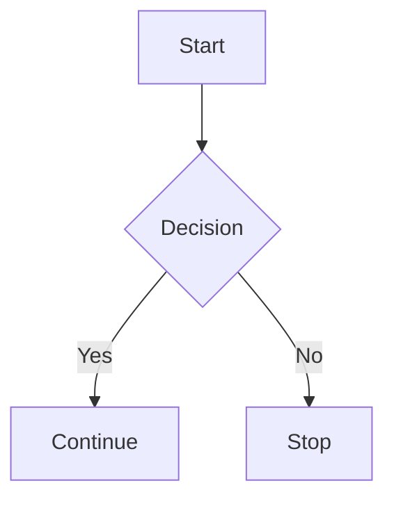

# Test Task with Diagram

Some text describing the task.

```mermaid
graph TD
  A[Start] --> B{Decision}
  B -->|Yes| C[Continue]
  B -->|No| D[Stop]
```

This diagram shows a simple decision flow.
